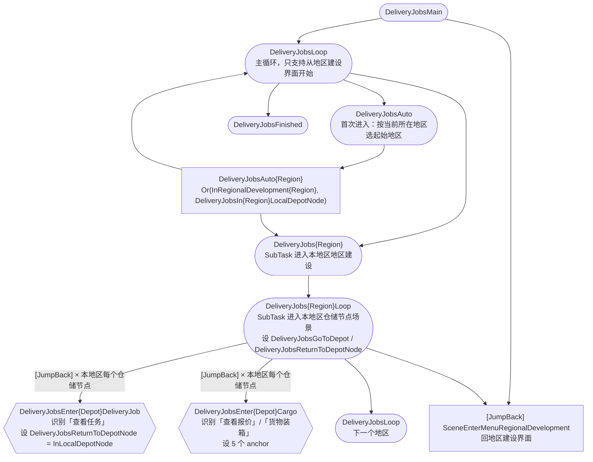
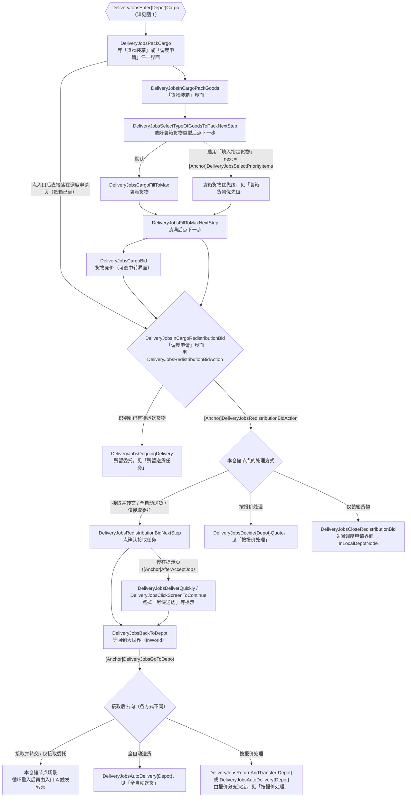
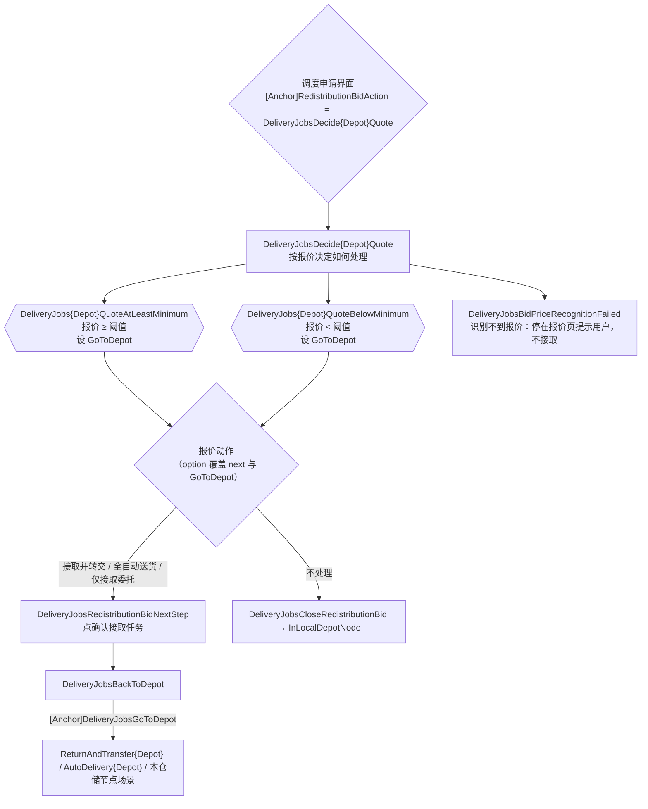
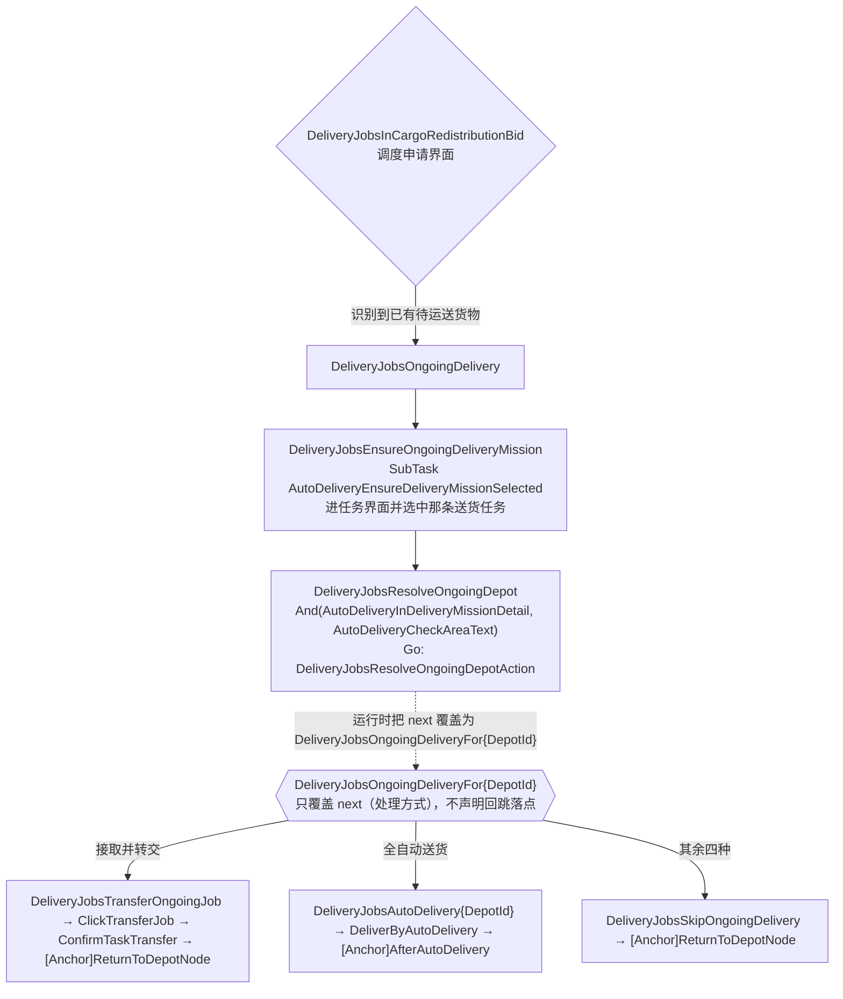
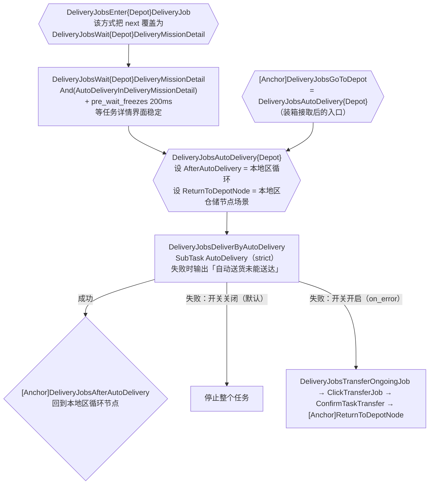
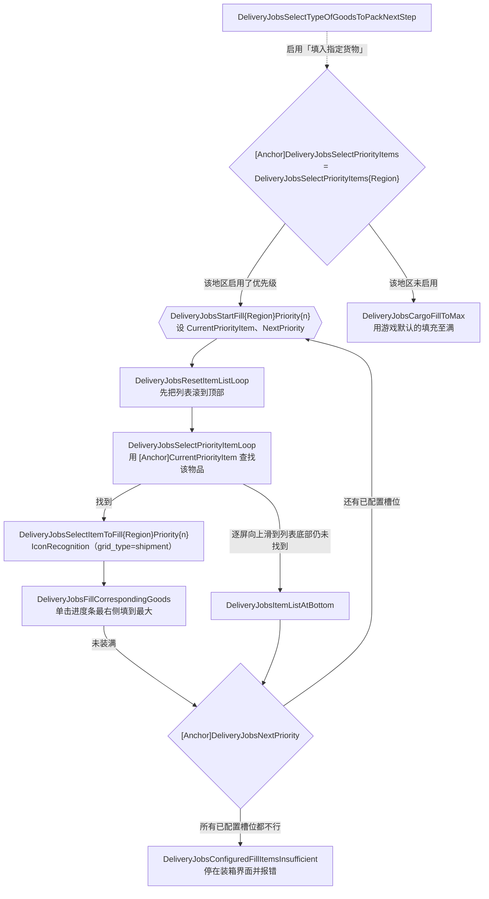

# 开发手册 - DeliveryJobs 转交委托

`DeliveryJobs`（任务名「转交委托」）按用户配置的地区与仓储节点遍历全部仓储节点，完成送货委托的装箱、接取与转交，可选把货物交给 [AutoDelivery](../components/auto-delivery.md) 全自动送掉。

本任务的三条结构性约定：

1. **生成产物不要手改**：`pipeline/DeliveryJobs.json`、`pipeline/DeliveryJobs/{Region,Depot}/**`、`PriorityItems.json`、`assets/tasks/DeliveryJobs.json` 全部由 `tools/pipeline-generate/DeliveryJobs/` 生成。手写流程只在 `PackCargo.json`、`TransferJob.json`、`AutoDelivery.json` 三个文件里。
2. **anchor 是这套流程的骨架**：同一个共享节点会被多个仓储节点、多种处理方式复用，它不知道自己在为谁服务，「下一步去哪」几乎全靠 anchor 传递。改流程前先看 [anchor 一览](#anchor-一览)。
3. **回跳落点由发起遍历的地区循环声明**：`DeliveryJobsReturnToDepotNode` 表示「本次遍历所在地区的仓储节点落点」，与残留委托的归属地无关。

Go Service 只提供 `DeliveryJobsResolveOngoingDepotAction`（`agent/go-service/deliveryjobs/`），用于从任务详情解析残留任务归属哪个仓储节点。任务遵循「Pipeline 管流程，Go 管算法」。

## 要点速览

- **入口**：`assets/tasks/DeliveryJobs.json` 的 `DeliveryJobs` 任务 → Pipeline 入口 `DeliveryJobsMain`，分组 `regional_development`。任务名与全部 option 名是配置持久化键，改名会让用户已有配置失效。
- **两级配置**：先开关地区（四号谷地 / 武陵），再逐个仓储节点选处理方式（六选一）。处理方式决定该仓储节点走哪条流程。
- **遍历粒度是仓储节点**：地区循环的每个候选都带 `[JumpBack]`，子链跑完回到循环节点再试下一个候选。所以「处理完一个仓储节点自动继续下一个」是循环重入实现的，不需要每个仓储节点自己声明后继。
- **同一个仓储节点在一次任务里可能被访问两次**：装箱接取后只回到仓储节点，真正转交由循环下一轮的「查看任务」入口触发（第二条路径见[两条转交路径](#两条转交路径)）。

## 流程总览

图中节点标签里的 `设 X` / `用 X` 标出锚点：六边形 `{{}}` 声明 anchor，菱形 `{}` 读取 anchor（`next` 里写 `[Anchor]X`），虚线表示由 option 覆盖产生的连线。`{Depot}` / `{Region}` 指代当前仓储节点与地区的 MaaEnd 标识（如 `OriginiumSciencePark` / `ValleyIV`）。

### 图 1：入口、地区循环与两个仓储节点入口



### 图 2：装箱 → 调度申请界面 → 按处理方式分派



## 仓储节点处理方式

每个仓储节点一个 `select`，默认「接取并转交」。六种方式通过覆盖该仓储节点的节点属性实现（`deliveryEnabled` / `cargoEnabled` 即 `DeliveryJobsEnter{Depot}DeliveryJob` / `DeliveryJobsEnter{Depot}Cargo` 的 `enabled`）：

| 处理方式 | 入口启用 | 装箱识别文本 | 调度申请界面动作 | 接取后去向 |
| ------------------ | ---------------- | ------------------------ | -------------------------------------- | -------------------------------------------------- |
| 接取并转交 | 两者都启用 | 查看报价 / 货物装箱 | `DeliveryJobsRedistributionBidNextStep` | `DeliveryJobsDeliverQuickly` → 回仓储节点 |
| 全自动送货 | 两者都启用 | 查看报价 / 货物装箱 | `DeliveryJobsRedistributionBidNextStep` | `DeliveryJobsAutoDelivery{Depot}` |
| 按报价处理 | 只启用货物入口 | 查看报价 / 货物装箱 | `DeliveryJobsDecide{Depot}Quote` | 由报价分支决定 |
| 仅接取委托 | 只启用货物入口 | 查看报价 / 货物装箱 | `DeliveryJobsRedistributionBidNextStep` | 回仓储节点，不转交 |
| 仅装箱货物 | 只启用货物入口 | 只有货物装箱 | `DeliveryJobsCloseRedistributionBid` | 关闭调度申请界面回仓储节点 |
| 不处理 | 两者都停用 | — | — | — |

几处容易误读的地方：

- **「接取并转交」的转交不在装箱流程里。** 装箱接取后只回到仓储节点，真正转交由地区循环下一轮命中入口 A（识别「查看任务」）触发，所以同一个仓储节点在一次任务里可能被访问两次。
- **「仅接取委托」和「仅装箱货物」靠停用入口 A 实现「不转交」**，不是靠流程判断；因此该仓储节点已有的送货任务在这两种方式下完全不被触碰。
- **「仅装箱货物」的装箱识别只认「货物装箱」**，不认「查看报价」：货箱已装满时入口显示「货物装箱」，未装满时才显示「查看报价」。
- **「不处理」不覆盖残留任务分派节点**，它走模板默认的 `DeliveryJobsSkipOngoingDelivery`（见[残留送货任务](#残留送货任务)）。
- **处理方式还决定残留委托的去向**：`deliveryEnabled` / `cargoEnabled` 只管入口开关，同一个 select 的残留委托动作另由生成器写进 `DeliveryJobsOngoingDeliveryFor{Depot}.next`（见[残留送货任务](#残留送货任务)）。

### 两条转交路径

同一个仓储节点里，「把箱子里的委托交出去」有两条独立路径，排查时不要只盯一条：

| # | 触发方式 | 经过的节点 | 何时走这条 |
| --- | ------------------------------ | ------------------------------------------------------------------------ | ------------------------------------------------ |
| 1 | 循环重入后命中入口 A「查看任务」 | `DeliveryJobsClickTransferJob` → `DeliveryJobsConfirmTaskTransfer` | 入口 A 启用且该仓储节点还有 `max_hit` 名额时 |
| 2 | 调度申请界面识别到已有待运送货物 | `DeliveryJobsOngoingDelivery` → … → `DeliveryJobsTransferOngoingJob`（仅当该委托归属仓储节点的方式是「接取并转交」，其余方式走 `DeliveryJobsSkipOngoingDelivery`） | 手里的委托还没有交出去，又进了这个仓储节点的装箱/调度申请流程时 |

### `DeliveryJobsEnter{Depot}PriceDeliveryJob`

它与 `DeliveryJobsEnter{Depot}DeliveryJob` 的识别、anchor、`next` 完全相同，两者都带 `max_hit: 1`。「按报价处理」下入口 A 为 `enabled: false`，本节点仍启用；该方式的报价动作选「接取并转交」时，由 `DeliveryJobsReturnAndTransfer{Depot}` 指向它。

## 按报价处理

选择「按报价处理」后，该仓储节点会额外出现三个选项：

| 选项 | 类型 | 默认 | 作用 |
| ---------------------------------------- | ------ | -------------- | ------------------------------------------------------ |
| 报价处理阈值 | input | 119000 | 与当前选中报价比较的整数值，校验 `^\d+$` |
| 达到或高于阈值时 | select | 接取并转交 | 报价 ≥ 阈值时执行哪个动作 |
| 低于阈值时 | select | 仅接取委托 | 报价 < 阈值时执行哪个动作 |

阈值与两侧动作的选项都是**每个仓储节点独立**的（`DeliveryJobsQuoteThreshold{DepotId}`、`DeliveryJobsAtLeastMinimumQuoteAction{DepotId}`、`DeliveryJobsBelowMinimumQuoteAction{DepotId}`），只在该仓储节点选「按报价处理」时才出现。



实现要点：

- 阈值以 `pipeline_type: string` 注入 `ExpressionRecognition.expression`，实际比较式是 `{DeliveryJobsSelectedBidPrice}>=<阈值>` 与 `{DeliveryJobsSelectedBidPrice}<{阈值}`。**`pipeline_type` 必须保持 `string`**：设为 `int` 会尝试把整个表达式转成整数，最终得到 `null`。
- 两侧动作都是四选一，取值与仓储节点处理方式**不共用**：`接取并转交` / `全自动送货` / `仅接取委托` / `不处理`，没有「按报价处理」和「仅装箱货物」两种取值。
- **「怎么接取」由节点的 `next` 表达，「接取后去哪」只由 `DeliveryJobsGoToDepot` 表达。** 三个「接取」动作共用同一个 `DeliveryJobsRedistributionBidNextStep`，差别只在锚点取值：`DeliveryJobsReturnAndTransfer{Depot}`（回仓储节点并转交）、`DeliveryJobsAutoDelivery{Depot}`（交给全自动送货）或本仓储节点场景（只回去）。
- 这些覆盖由 option 直接改写 `DeliveryJobs{Depot}QuoteAtLeastMinimum` / `DeliveryJobs{Depot}QuoteBelowMinimum` 的 `next` 与 `anchor.DeliveryJobsGoToDepot`。「不处理」把 `next` 指向 `DeliveryJobsCloseRedistributionBid`，此时不经过 `DeliveryJobsBackToDepot`，`DeliveryJobsGoToDepot` 不参与。
- `pipeline_override` 对 `anchor` 对象和数组 `next` 都是**整体替换**，覆盖时必须给全该字段，不要只写想改的那一项。
- 报价 OCR 失败（`DeliveryJobsBidPriceRecognitionFailed`）直接 `StopTask` 并停在报价页，不猜、不自动接取。

## 残留送货任务

在调度申请界面识别到「有待运送的货物，请先完成送货」时，`DeliveryJobsInCargoRedistributionBid` 的 `next` 会先命中 `DeliveryJobsOngoingDelivery`，进入残留任务处理，而不是执行本仓储节点的调度申请动作：



`DeliveryJobsResolveOngoingDepotAction` 用任务详情「当前区域」的 OCR 文本匹配仓储节点，把 `next` 覆盖为对应的分派节点。分派依据是**残留任务归属仓储节点**的处理方式，与当前正在遍历哪个仓储节点无关——残留任务可能来自上一个仓储节点，也可能来自本次根本没遍历到的节点：

| 归属仓储节点的处理方式 | 去向 | 结果 |
| ------------------------------- | ---------------------------------- | ------------------------------------------ |
| 接取并转交 | `DeliveryJobsTransferOngoingJob` | 转交后回本地区仓储节点，继续地区循环 |
| 全自动送货 | `DeliveryJobsAutoDelivery{DepotId}` | 送掉后回地区循环 |
| 按报价处理 / 仅接取委托 / 仅装箱货物 | `DeliveryJobsSkipOngoingDelivery` | 退出任务界面，回本地区仓储节点继续遍历 |
| 不处理 | 同上（不覆盖分派节点，走模板默认） | 同上 |

任务详情里的区域名与仓储节点名在五种语言下逐字一致，Go 侧才能用区域 ID 直接拼出 `DeliveryJobsOngoingDeliveryFor{ID}` 这个节点名；这条恒等关系由 `model.mjs` 在生成时断言，两边不各写一套映射。Go 侧仓储节点名取自 `global.region.{DepotId}`，与节点名后缀同源。

这条链路会改动正常流程，因此每一步都向用户输出 Focus 提示，说明原因与采取的行为；本任务的提示都以 🚚 开头，与其他模块的提示（如全自动送货阶段的 🚛）在运行日志里区分开：

| 节点 | 提示内容 | 文案来源 |
| ------------------------------------------ | ------------------------------------------------------ | ------------------------------------------ |
| `DeliveryJobsOngoingDelivery` | 🚚 检测到未完成的送货任务，将打开送货任务查看详情 | `task.DeliveryJobs.OngoingDeliveryDetected`（interface locale） |
| `DeliveryJobsResolveOngoingDepotAction`（Go） | 🚚 该送货任务属于〈仓储节点名〉 | `deliveryjobs.focus.ongoing_depot_resolved`（go-service locale） |
| 同上，解析失败 | 🚚 未能确定未完成的送货任务属于哪个仓储节点，详见运行日志 | `deliveryjobs.focus.ongoing_depot_unresolved`（go-service locale） |
| `DeliveryJobsSkipOngoingDelivery` | 🚚 该送货任务所属的仓储节点不处理它，已跳过并回到仓储节点继续遍历 | `task.DeliveryJobs.OngoingDeliverySkipped`（interface locale） |
| `DeliveryJobsDeliverByAutoDelivery`（动作失败） | 🚚 自动送货未能送达 | `task.DeliveryJobs.AutoDeliveryFailed`（interface locale） |
| `DeliveryJobsTransferOngoingJob` | 🚚 按该送货任务所属仓储节点的设置转交它 | `task.DeliveryJobs.OngoingDeliveryTransferred`（interface locale） |

检测由 `DeliveryJobsOngoingDelivery` 在识别到提示文案时输出，归属由 Go 侧在解析出区域后输出，两个出口各自说明自己采取的行为；每条只说该步骤新增的信息。自动送货的失败原因挂在公共调用节点的动作失败上，开关开或关都会提示，开关只决定失败后是否转交。

## 全自动送货



「全自动送货」只在 `delivery_destinations.json` 中有归属终点的仓储节点上提供——没有终点的仓储节点无处可送，仓储节点处理方式与两侧报价动作都不给出这个选项。

- **入口 A 的边上多一个门节点 `DeliveryJobsWait{Depot}DeliveryMissionDetail`**：识别 `And(AutoDeliveryInDeliveryMissionDetail)`，等任务详情区域静止 200ms（等待区域与组件的 `AutoDeliveryInDeliveryMissionDetail` 相同），通过后进 `DeliveryJobsAutoDelivery{Depot}`。
- 进入 `DeliveryJobsAutoDelivery{Depot}` 的另外两个入口不经过这个门：装箱接取后的 `[Anchor]DeliveryJobsGoToDepot`，以及残留委托的 `DeliveryJobsOngoingDeliveryFor{DepotId}`。
- DeliveryJobs 不直接把 `AutoDelivery` 放进 `next`。各仓储节点的 `DeliveryJobsAutoDelivery{Depot}` 只负责声明回跳锚点（`DeliveryJobsAfterAutoDelivery`、`DeliveryJobsReturnToDepotNode`），再交给公共调用节点 `DeliveryJobsDeliverByAutoDelivery`。
- `DeliveryJobsDeliverByAutoDelivery` 用 strict `SubTask` 包裹 `AutoDelivery`，组件内部任意环节失败都会浮现在自身动作上，`on_error` 只需在这一处配置。当前处于取货还是送货阶段由组件根据任务详情自行判断，调用方无需为详情切换配置额外入口或 anchor。
- 「送货时优先使用滑索」开关通过 `AutoDeliveryNavigateDepot` / `AutoDeliveryNavigateDestination` 的 `attach.zip` 传给 AutoDelivery（Go 侧读的就是这两个节点的 `attach`）。它只允许导航在预计更快且滑索已供电、可正常上下索时使用滑索，不保证每条路线都会选择滑索。`routes.json` 中声明 `zipline_only` 的目标（如裴令容）例外：它们只能坐滑索送达，开关为关时 AutoDelivery 会直接输出提示并让动作失败，不会尝试步行（见 [AutoDelivery 组件维护](../components/auto-delivery.md)）。
- 「送货失败后自动转交任务」开关把 `DeliveryJobsDeliverByAutoDelivery.on_error` 设为 `DeliveryJobsTransferOngoingJob`。关闭（默认）时全自动送货失败即停止整个任务，只输出失败原因；开启时由转交节点接管，自动转交当前任务并继续地区循环。该功能仍处于测试阶段。

## 装箱货物优先级

启用「填入指定货物」后，`DeliveryJobsSelectTypeOfGoodsToPackNextStep` 的 `next` 从默认的「装满货物」改为 `[Anchor]DeliveryJobsSelectPriorityItems`，流程改走优先级查找。该选项按地区展开，每个地区可设 4 个优先级槽位（`WhatToFill{Region}Priority1..4`）。



- 每个槽位独立配置物品，取值是稳定 item ID，显示名复用 `iconRecognition.name.*`；默认优先级 1 为砂叶粉末，优先级 2 至 4 为「不指定」。
- 每个优先级槽位使用同一份地区物品列表，由生成器按地区各仓储节点 `fillable_items` 的交集算出；`DeliveryJobsSelectItemToFill*` 在 ADB 下有一套独立 roi（`resource_adb/pipeline/DeliveryJobs/PriorityItems.json`）。
- 所有已配置物品都装不满时 `DeliveryJobsConfiguredFillItemsInsufficient` 报错并停在装箱界面，不静默继续。
- 未启用该选项时走 `DeliveryJobsCargoFillToMax`，使用游戏默认的填充至满。

## anchor 一览

DeliveryJobs 的共享节点不知道自己在为哪个仓储节点服务，全靠 anchor 传递上下文。当前用到八个，全部声明点与读取点都在 Pipeline 内，唯一例外是 `DeliveryJobsSelectPriorityItems`（读者在 `assets/tasks/DeliveryJobs.json` 的 option 里）：

| anchor | 声明者 | 消费者 | 读取时所处界面 |
| ------------------------------------ | ------------------------------------------------------------------------------- | ------------------------------------------ | -------------------------------------- |
| `DeliveryJobsReturnToDepotNode` | `DeliveryJobs{Region}Loop`、`DeliveryJobsEnter{Depot}DeliveryJob`、`DeliveryJobsEnter{Depot}PriceDeliveryJob`、`DeliveryJobsEnter{Depot}Cargo`、`DeliveryJobsAutoDelivery{Depot}` | `DeliveryJobsConfirmTaskTransfer`、`DeliveryJobsSkipOngoingDelivery` | 任务界面（转交确认弹窗 / 任务详情） |
| `DeliveryJobsGoToDepot` | `DeliveryJobs{Region}Loop`、`DeliveryJobsEnter{Depot}Cargo`、`DeliveryJobs{Depot}QuoteAtLeastMinimum/BelowMinimum` | `DeliveryJobsBackToDepot` | 大世界 |
| `DeliveryJobsSelectPriorityItems` | `DeliveryJobsEnter{Depot}Cargo` | `DeliveryJobsSelectTypeOfGoodsToPackNextStep`（在任务 option 里） | 货物装箱界面 |
| `DeliveryJobsRedistributionBidAction` | `DeliveryJobsEnter{Depot}Cargo` | `DeliveryJobsInCargoRedistributionBid` | 调度申请界面 |
| `DeliveryJobsAfterAcceptJob` | `DeliveryJobsEnter{Depot}Cargo` | `DeliveryJobsRedistributionBidNextStep` | 调度申请界面（点确认接取后） |
| `DeliveryJobsCurrentPriorityItem` | `DeliveryJobsStartFill{Region}Priority{1..4}` | `DeliveryJobsSelectPriorityItemLoop` | 装箱物品列表 |
| `DeliveryJobsNextPriority` | `DeliveryJobsStartFill{Region}Priority{1..4}` | `DeliveryJobsFillCorrespondingGoods`、`DeliveryJobsItemListAtBottom` | 装箱物品列表 |
| `DeliveryJobsAfterAutoDelivery` | `DeliveryJobsAutoDelivery{Depot}` | `DeliveryJobsDeliverByAutoDelivery` | 送货结束后的界面 |

表中除 `DeliveryJobsReturnToDepotNode` 外的 anchor，读取方都是跨仓储节点或跨地区的共享节点，取值随声明方变化：`DeliveryJobsSelectPriorityItems` 取本地区的优先级入口，`DeliveryJobsRedistributionBidAction` 与 `DeliveryJobsAfterAcceptJob` 随仓储节点的处理方式变化，`DeliveryJobsGoToDepot` 随接取后的去向变化。

### `DeliveryJobsReturnToDepotNode`：本地区仓储节点的落点

转交确认后要回到哪里，取决于这次转交是在哪个界面发起的：仓储节点界面发起的转交仍在仓储节点界面结束；任务界面发起的转交会落在菜单列表，需要重新进仓储节点。`DeliveryJobsConfirmTaskTransfer` 不判断界面，只按这个锚点跳转。

规则是**回跳归发起遍历的那个地区循环，谁在遍历谁就声明它**：

| 声明者 | 值 | 场景 |
| ------------------------------------------ | ---------------- | ------------------------------------------------ |
| `DeliveryJobs{Region}Loop` | 本地区仓储节点场景 | 循环入口：供本轮迭代中未经过更具体声明者的流程使用 |
| `DeliveryJobsEnter{Depot}DeliveryJob` | `InLocalDepotNode` | 在仓储节点界面发起转交，转交后只需等界面加载 |
| `DeliveryJobsEnter{Depot}PriceDeliveryJob` | `InLocalDepotNode` | 同上（报价达标路径） |
| `DeliveryJobsEnter{Depot}Cargo` | 本地区仓储节点场景 | 从任务界面进入装箱；`DeliveryJobsSkipOngoingDelivery` 的落点由它给出 |
| `DeliveryJobsAutoDelivery{Depot}` | 本地区仓储节点场景 | 全自动送货失败后转交，需要从任务界面退出 |

消费者有两个，都是「离开任务界面后要回到仓储节点」：`DeliveryJobsConfirmTaskTransfer`（转交确认）与 `DeliveryJobsSkipOngoingDelivery`（跳过不处理的残留任务）。

> [!IMPORTANT]
>
> **落点由发起遍历的地区循环决定，不由残留任务的归属地决定。** `DeliveryJobsOngoingDeliveryFor{DepotId}` 的 id 来自 `DeliveryJobsResolveOngoingDepot` 的区域 OCR，可以指向别的地区，因此它只覆盖 `next`（处理方式），不声明落点。同理，`DeliveryJobsTransferOngoingJob`、`DeliveryJobsClickTransferJob`、`DeliveryJobsDeliverByAutoDelivery` 都排在声明者之后、消费者之前执行，也不声明。`DeliveryJobsAutoDelivery{Depot}` 声明它，是因为「送货失败后自动转交任务」的 `on_error` 直接接到转交流程，不经过 `DeliveryJobsOngoingDeliveryFor{DepotId}`。

排查同类问题的通用问法：**这个节点的落点是否取决于从哪个界面进入？** 如果是，落点就必须由发起方声明；写死或由共享节点兜底，都会在某个入口上失效。

## 选项配置一览

| 选项 | 类型 | 默认 | 作用 |
| ------------------------------------------------ | ------ | -------------- | ------------------------------------------------ |
| 四号谷地 / 武陵 | switch | 开 | 启停地区；关闭即 `enabled: false` 该地区节点 |
| `{仓储节点}` | select | 接取并转交 | 该仓储节点的处理方式（六选一） |
| 报价处理阈值 | input | 119000 | 仅「按报价处理」时出现 |
| 达到或高于阈值时 / 低于阈值时 | select | 接取并转交 / 仅接取委托 | 仅「按报价处理」时出现 |
| 填入指定货物 | switch | 关 | 启用后展开每地区 4 个优先级槽位 |
| `{地区} · 优先级 1..4` | select | 砂叶粉末 / 不指定 | 仅启用「填入指定货物」时出现 |
| 送货时优先使用滑索 | switch | 关 | 传给 AutoDelivery 的 `attach.zip` |
| 送货失败后自动转交任务 | switch | 关 | 设置 `DeliveryJobsDeliverByAutoDelivery.on_error` |

旧版的全局「仅接取任务」「仅装箱货物」开关已被逐仓储节点选项取代，旧版的单货物配置也不会迁移到新的优先级配置；升级后需要重新选择各仓储节点的处理方式。

## 运行期提示与失败行为

- 报价识别失败：停在报价页并提示用户手动确认，不自动接取。
- 装箱物品不足：停在装箱界面并报错，提示调整优先级或补充库存。
- 全自动送货失败：由「送货失败后自动转交任务」决定停止任务还是转交后继续。
- 仓储节点未解锁：SceneManager 进不去对应场景，任务终止。

## 已知边界

- **「按报价处理」下每个仓储节点每次运行最多完成一次「达标 → 接取 → 转交」。** `DeliveryJobsEnter{Depot}PriceDeliveryJob` 带 `max_hit: 1`，而该方式把残留委托动作设成 `DeliveryJobsSkipOngoingDelivery`，于是第二条已接未转交的委托不会被再处理（「接取并转交」没有这个问题，它的残留动作是 `DeliveryJobsTransferOngoingJob`，第二条会走[两条转交路径](#两条转交路径)的第 2 条）。本条由节点配置推得，尚未实机确认。
- `DeliveryJobsCheck{Depot}Cargo.expected` 的文本清单在 `depot-template.jsonc` 与 `task-template.mjs` 的 `ALL_CARGO_EXPECTED` / `PACK_CARGO_EXPECTED` 各有一份：option 覆盖总会生效，模板那份只在直接调试 Pipeline 时可见，**改一处要同步另一处**。
- 报价阈值默认值 `119000` 同样在模板表达式与 option `default` 各有一份。

## 生成器与维护

生成、数据来源、新增地区或仓储节点的步骤，见 [`tools/pipeline-generate/DeliveryJobs/README.md`](../../../../tools/pipeline-generate/DeliveryJobs/README.md)。这里只列改流程时需要知道的手写文件：

| 文件 | 职责 |
| --------------------------------- | --------------------------------------------------------------------------------- |
| `DeliveryJobs/PackCargo.json` | 装箱、调度申请界面、报价动作、残留任务处理、回仓储节点 |
| `DeliveryJobs/TransferJob.json` | 点击转交 → 确认转交 → 按 `DeliveryJobsReturnToDepotNode` 跳转 |
| `DeliveryJobs/AutoDelivery.json` | `DeliveryJobsDeliverByAutoDelivery`，全自动送货的唯一调用点 |
| `DeliveryJobs.json` | 任务入口与主循环（生成，但流程结构变更需改 `core-template.jsonc`） |

数据版本未变时，可以跳过网络直接重新生成：

```bash
node tools/pipeline-generate/DeliveryJobs/sync-locales.mjs
node tools/pipeline-generate/DeliveryJobs/prepare.mjs
node tools/pipeline-generate/run-all.mjs DeliveryJobs
```

改动检查清单：

- 新增「离开任务界面后回仓储节点」的流程 → 先确认发起方声明了 `DeliveryJobsReturnToDepotNode`。
- 给共享节点加 anchor → 确认它在所有声明者之后、消费者之前都不会覆盖发起方的值。
- 改 anchor 取值或节点名 → 全仓库搜旧值，`assets/tasks/DeliveryJobs.json`、`tools/pipeline-generate/DeliveryJobs/README.md` 与测试里可能有硬编码。
- 改 option 的覆盖内容 → 覆盖 `anchor` / `next` 是整体替换，注意不要漏字段。
- 提交前至少运行 `pnpm check`、`pnpm test`。
